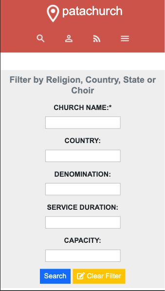
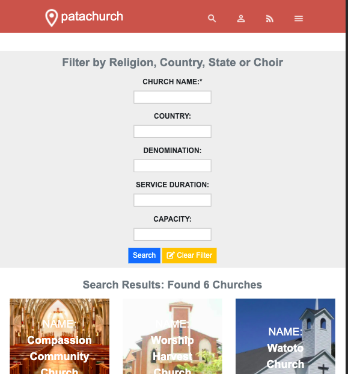

# PataChurch

> Patachurch is an online Church Directory containing thousands of entries form different Churches, of all denominations in East Africa. 

- Small Screens

- Medium Screens

- Large Screens

- Note: 'Web App' and 'Directory' are used interchangeably in this README
- Users can Sign Up and have accounts on the Web App
- Users within East Africa can search for any church of their preference in our directory.
- The Directory has state of the Art filters that enable users to filter down searches to specifics like church size and denomination to mention a few.
- The Web App includes a Blog where the lates information regarding the Directory is stored.

## Built With

- HTML5 and CSS
- [Bootstrap](https://getbootstrap.com/)
- [Google Icons and Fonts](https://fonts.google.com/)
- [Font Awesome](https://fontawesome.com/)

## Live Demo

[Live Demo Link](https://emmyobonyo.github.io/Chruch-Directory/)

## Getting Started

To get a local copy up and running follow these simple example steps.

### Prerequisites

- A computer and some internet I guess; which if you're viewing this page, you already have :)

### Setup

- Open terminal (Mac, Linux) or Command Line (Windows) at a directory on your computer where you'd like the project stored, and paste this command `git clone https://github.com/emmyobonyo/Chruch-Directory.git` and then `cd Church-Directory`

- Look for the `index.html` file and open in your favourite browser.

## Authors

👤 **Emmanuel Obonyo**

- GitHub: [@emmyobonyo](https://github.com/emmyobonyo)
- Twitter: [@emmyobonyo](https://twitter.com/emmyobonyo)
- LinkedIn: [Emmanuel Obonyo](https://www.linkedin.com/in/emmanuel-obonyo-3728a2200/)

## 🤝 Contributing

Contributions, issues, and feature requests are welcome!

Feel free to check the [issues page](https://github.com/emmyobonyo/Chruch-Directory/issues).

## Show your support

Give a ⭐️ if you like this project!

## 📝 License

This project is [MIT](./MIT.md) licensed.
